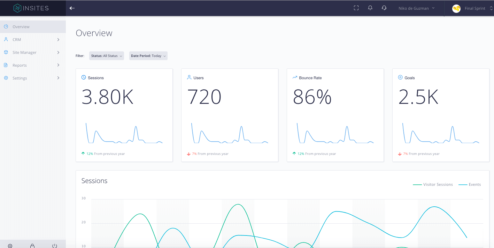

# Insites PlatformOS Admin

This open source project provides the needed PlatformOS admin capabilities. 



## How To Integrate:
Copy all files to your Project's marketplace_builder folder

# Insites 2.0

### Insites 2.0
TODO: Update Insites 2.0 Description

### Why Insites 2.0?
TODO: Include the purpose, scope, and limitaions of Insites 2.0

### Getting Started

To create a new project using an interactive CLI, run:
```
$ git clone git@github.com:CompBusOnline/insites-platform-os-admin.git
$ git fetch && git checkout development
$ npm install
$ npm run dev
$ npm run build
```

### Components

| COMPONENT | DESCRIPTION |
| ------- | ------- |
| [ins-datepicker][ins-datepicker] | is tied to a standard form input field Focus on the input click to open an interactive calendar in a small overlay  |
| [ins-sidebar][ins-sidebar] | Slide the page content to the right when opening the navigation pane |
| [ins-sidebar-item][ins-sidebar-item] | related to ins-sidebar components displays sidebar item list |
| [ins-card][ins-card] | Serves as padding for ins-sparkline |
| [ins-sparkline][ins-sparkline] | displays charts like session, users, bounce rate, and goals in dashboard |
| [ins-table][ins-table] | displays table in dashboard |
| [ins-line-chart][ins-line-chart] | is represented by a series of datapoints connected with a straight line |
| [ins-bar-chart][ins-bar-chart] | is exactly the same as a column chart only the x-axis and y-axis are switched |
| [ins-admin][ins-admin] | displays whole admin page |
| [ins-content][ins-content] | displays content of admin page parent component is ins-admin |
| [ins-renderer][ins-renderer] | render an iframe parent component is ins-content |
| [ins-button][ins-button] | Defines a clickable button |
| [ins-filter][ins-filter] | Acts as container for ins-filter-item |
| [ins-header][ins-header] | Acts as parent container for header components |
| [ins-header-user][ins-header-user] | Displays items inside header |
| [ins-instances-item][ins-instances-item] | Displays item selection for ins-instances dropdown feature |
| [ins-instances][ins-instances] | Displays dropdown feature with logo inside header container |
| [ins-loader][ins-loader] | Acts as a loader in page while waiting to view content |
| [ins-select][ins-select] | Displays drop down feature |
| [ins-select-option][ins-select-option] | Displays choices of dropdown feature |
| [ins-instances-sub-item][ins-instances-sub-item] | Displays sub items for ins-instances-items |


### Browser Support
- Chrome (and all Chromium based browsers)
- Safari
- Firefox

### License
N/A

----
<!-- <link> -->
[ins-datepicker]: /components/src/components/ins-datepicker/README.md
[ins-sidebar]: /components/src/components/ins-sidebar/README.md
[ins-sidebar-item]: /components/src/components/ins-sidebar-item/README.md
[ins-card]: /components/src/components/ins-card/README.md
[ins-sparkline]: /components/src/components/ins-sparkline/README.md
[ins-table]: /components/src/components/ins-table/README.md
[ins-line-chart]: /components/src/components/ins-line-chart/README.md
[ins-bar-chart]: /components/src/components/ins-bar-chart/README.md
[ins-admin]: /components/src/components/ins-admin/README.md
[ins-content]: /components/src/components/ins-content/README.md
[ins-renderer]: /components/src/components/ins-renderer/README.md
[ins-button]: /components/src/components/ins-button/README.md
[ins-filter]: /components/src/components/ins-filter/README.md
[ins-header]: /components/src/components/ins-header/README.md
[ins-header-user]: /components/src/components/ins-header-user/README.md
[ins-instances-item]: /components/src/components/ins-instances-item/README.md
[ins-instances]: /components/src/components/ins-instances/README.md
[ins-loader]: /components/src/components/ins-loader/README.md
[ins-select]: /components/src/components/ins-select/README.md
[ins-select-option]: /components/src/components/ins-select-option/README.md
[ins-instances-sub-item]: /components/src/components/ins-instances-sub-item/README.md

